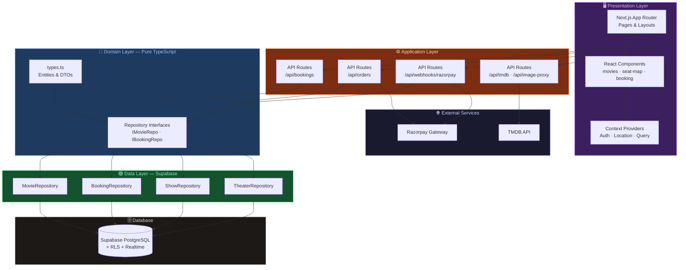
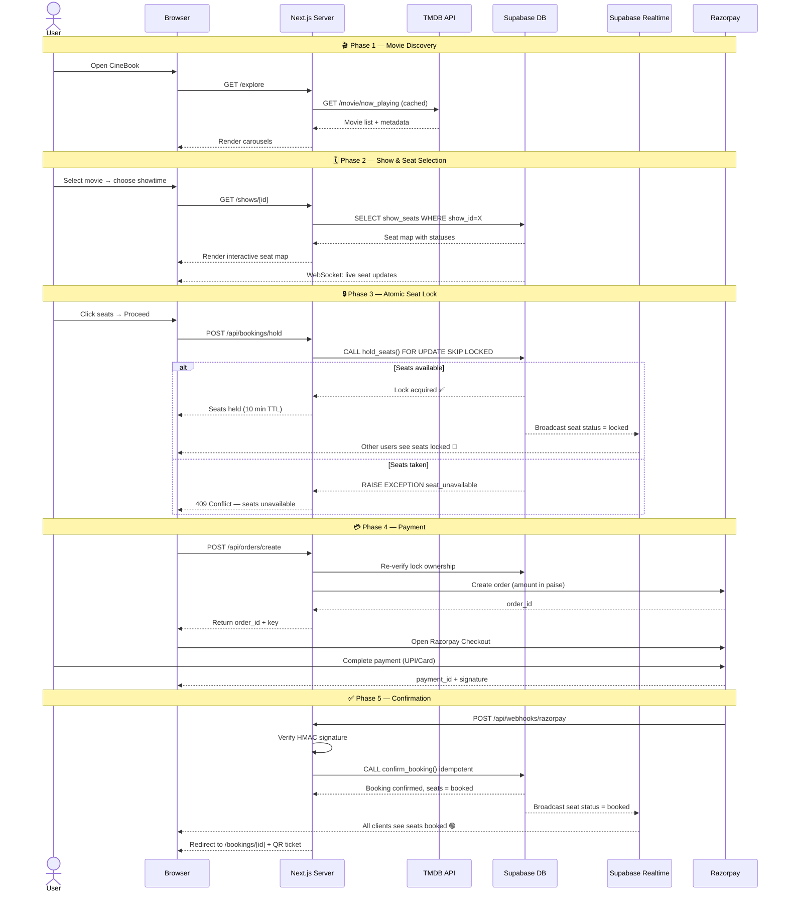
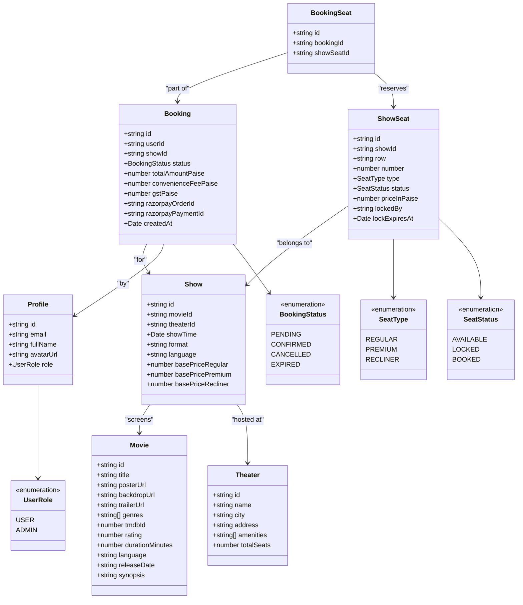
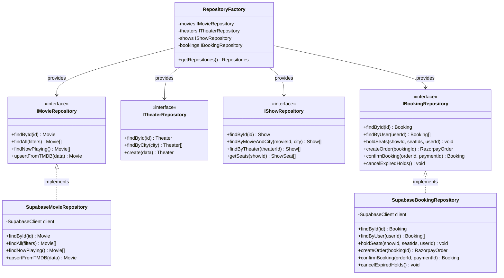

<div align="center">

# 🎬 CineBook

### A Production-Grade Movie Ticket Booking Platform

[](https://nextjs.org/)
[](https://www.typescriptlang.org/)
[](https://supabase.com/)
[](https://tailwindcss.com/)
[](https://razorpay.com/)
[](https://www.themoviedb.org/)
[](https://vercel.com/)
[](https://opensource.org/licenses/MIT)

**CineBook** is a full-stack, production-ready movie ticket booking web app — inspired by BookMyShow and Fandango — built from scratch with a clean domain-driven architecture, real-time seat updates, and a secure payment flow via Razorpay.

[Features](#-features) · [Architecture](#-architecture) · [System Design](#-system-design) · [Class Diagrams](#-class-diagrams) · [Getting Started](#-getting-started)

</div>

---

## ✨ Features

### 🎥 Movie Discovery
- **TMDB API Integration** — Browse 10,000+ movies with live poster art, ratings, and trailers
- **Netflix-style Explore Page** — Carousels by genre, language, and popularity with animated transitions
- **Multiselect Filters** — Filter by language, genre, format (IMAX, 4DX, Dolby), and city
- **Image Proxy** — Local `/api/image-proxy` endpoint ensures posters load even on ISP-restricted networks

### 🏟️ Showtimes & Theatres
- **10 Indian Cities** — Mumbai, Delhi, Bengaluru, Chennai, Hyderabad, Kolkata, Pune, Ahmedabad, Jaipur, Lucknow
- **Real Cinema Chains** — PVR, INOX, Cinepolis, Miraj, and local multiplexes seeded in the database
- **Dynamic Showtime Grid** — Auto-generated morning/afternoon/evening/night show slots
- **City-Aware Header** — Sticky header with persistent city selection via React Context

### 💺 Seat Selection
- **Interactive Seat Map** — Visual row-by-row layout with real-time status (available / locked / booked)
- **Seat Categories** — Regular, Premium, and Recliner seats with price multipliers (1×, 1.5×, 2×)
- **Supabase Realtime** — Live seat status updates via WebSocket subscriptions — no polling required

### 🔒 Anti-Double-Booking
- **Postgres `SELECT … FOR UPDATE SKIP LOCKED`** — Atomic seat reservation at the database level
- **30-Second Lock TTL** — `pg_cron` releases expired holds every 30 seconds automatically
- **Idempotent Confirmation** — Razorpay webhook calls are safe to replay; no duplicate bookings created
- **Re-verification** — Server re-checks lock ownership before creating a payment order

### 💳 Payments (Razorpay)
- **Razorpay Checkout** — Secure hosted checkout flow with UPI, Cards, Net Banking, and Wallets
- **Webhook Verification** — Signature-validated webhook endpoint confirms payment server-side
- **Paise-precise Accounting** — All amounts stored as integers (paise); no floating-point money bugs
- **Fee Breakdown** — Convenience fee (2.5%) + GST (18%) calculated transparently

### 👤 Auth & Profiles
- **Supabase Auth** — Email/password + Google OAuth
- **Row Level Security** — Every table protected by Postgres RLS policies
- **Admin Role** — Promote users to `admin` via SQL; unlock show/theater management dashboard

### 📱 UX & Design
- **Framer Motion** — Page transitions, card reveals, and micro-interactions throughout
- **Dark Mode** — Cinematic dark palette throughout
- **Responsive** — Mobile-first layout, works on all screen sizes
- **Toast Notifications** — React Hot Toast for all async feedback
- **QR Code Tickets** — `qrcode.react` generates downloadable booking QR codes

---

## 🏗️ Architecture

CineBook uses a clean **Domain-Driven Design (DDD)** layered architecture with strict separation between domain logic, data access, and UI.



The domain layer (`lib/domain/`) has **zero dependencies** on Supabase or any external library — making it fully testable and swappable.

---

## 🔭 System Design

End-to-end request flow for a complete ticket booking, from browser to database:



---

## 📐 Class Diagrams

### Domain Entities



### Repository & Service Interfaces



---

## 🗄️ Database Schema

### Core Tables

| Table | Purpose |
|-------|---------|
| `profiles` | User profiles linked to Supabase Auth (`id = auth.uid()`) |
| `movies` | Movie metadata (title, poster, genres, TMDB ID, trailer URL) |
| `theaters` | Cinema halls with city, location, and amenities |
| `shows` | A screening instance — links movie + theater + date/time |
| `show_seats` | Individual seats per show with status + price |
| `bookings` | A confirmed or pending booking by a user |
| `booking_seats` | Junction table — which seats belong to which booking |

### Key Postgres Features Used

- **RLS Policies** — Row Level Security on all tables (users only see their own bookings)
- **`hold_seats` RPC** — Atomic seat reservation using `SELECT … FOR UPDATE SKIP LOCKED`
- **`confirm_booking` RPC** — Idempotent booking confirmation triggered by Razorpay webhook
- **`pg_cron`** — Scheduled job releases expired seat holds every 30 seconds
- **Realtime** — Supabase Realtime subscriptions broadcast seat status changes instantly

---

## 🚀 Getting Started

### Prerequisites

- **Node.js** 18+ and **npm** 9+
- A **Supabase** project (free tier is fine)
- A **Razorpay** account (test mode keys are sufficient)
- A **TMDB API key** (free at [themoviedb.org](https://www.themoviedb.org/settings/api))

---

### 1. Clone the Repository

```bash
git clone https://github.com/RishiRaj1100/CINEBOOK.git
cd CINEBOOK/movie-booking
```

### 2. Install Dependencies

```bash
npm install
```

### 3. Configure Environment Variables

Copy the example env file and fill in your credentials:

```bash
cp .env.example .env.local
```

Edit `.env.local`:

```env
# Supabase
NEXT_PUBLIC_SUPABASE_URL=https://your-project-id.supabase.co
NEXT_PUBLIC_SUPABASE_ANON_KEY=your-anon-key
SUPABASE_SERVICE_ROLE_KEY=your-service-role-key

# TMDB
TMDB_API_KEY=your-tmdb-api-key
NEXT_PUBLIC_TMDB_API_KEY=your-tmdb-api-key

# Razorpay (use Test Mode keys)
RAZORPAY_KEY_ID=rzp_test_xxxxxxxxxxxx
RAZORPAY_KEY_SECRET=your-razorpay-secret
NEXT_PUBLIC_RAZORPAY_KEY_ID=rzp_test_xxxxxxxxxxxx

# App URL (set to your Vercel domain in production)
NEXT_PUBLIC_APP_URL=http://localhost:3000
```

> **Get your keys from:**
> - Supabase: [supabase.com/dashboard](https://supabase.com/dashboard) → Project Settings → API
> - TMDB: [themoviedb.org/settings/api](https://www.themoviedb.org/settings/api)
> - Razorpay: [dashboard.razorpay.com/app/keys](https://dashboard.razorpay.com/app/keys) (switch to **Test Mode**)

### 4. Run Database Migrations

Open your [Supabase SQL Editor](https://supabase.com/dashboard) and run these files **in order**:

| Step | File | Description |
|------|------|-------------|
| 1 | `supabase/migrations/001_schema.sql` | Tables, indexes, and triggers |
| 2 | `supabase/migrations/002_rls.sql` | Row Level Security policies |
| 3 | `supabase/migrations/003_functions.sql` | RPC functions + `pg_cron` job |
| 4 | `supabase/migrations/004_seed.sql` | Sample movies & theaters *(optional)* |

> **Enable `pg_cron`** in Supabase: Dashboard → Database → Extensions → search `pg_cron` → Enable

### 5. Seed Movies from TMDB *(Optional)*

```bash
# Sync now-playing movies from TMDB into your Supabase movies table
npm run db:sync-movies

# Seed show times and seats for seeded movies
npm run db:seed
```

### 6. Make Yourself an Admin *(Optional)*

After signing up via the app, run this in the Supabase SQL Editor:

```sql
UPDATE profiles SET role = 'admin' WHERE id = 'your-auth-user-uuid';
```

Find your UUID: Supabase Dashboard → **Authentication** → **Users**.

### 7. Configure Google OAuth *(Optional)*

1. [Google Cloud Console](https://console.cloud.google.com/) → **APIs & Services** → **Credentials** → **Create OAuth 2.0 Client ID**
2. Add Authorized Redirect URI:
   ```
   https://your-project-id.supabase.co/auth/v1/callback
   ```
3. Supabase Dashboard → **Authentication** → **Providers** → **Google** → paste Client ID + Secret

### 8. Start the Dev Server

```bash
npm run dev
# → http://localhost:3000
```

---

---

## 💡 Key Technical Decisions

### Why `SELECT … FOR UPDATE SKIP LOCKED`?
Standard `UPDATE` statements don't prevent race conditions in concurrent booking scenarios. By using `SELECT … FOR UPDATE SKIP LOCKED` inside a Postgres transaction, CineBook guarantees that only one user can hold a seat at a time — even under high concurrency — without application-level locking.

### Why Paise (integer) instead of floats?
Floating-point arithmetic is inherently imprecise for currency. Storing amounts as integers (smallest unit — paise for INR) eliminates rounding errors entirely. `₹150.50 = 15050 paise`.

### Why Domain-Driven Architecture?
The `lib/domain/` layer contains pure TypeScript types and interfaces with zero external dependencies. This means:
- **Testable** — Unit tests don't need a Supabase connection
- **Swappable** — Replace Supabase with any other database by writing a new `data/` implementation
- **Readable** — Business logic is clearly separated from infrastructure concerns

### Why TMDB Image Proxy?
Some Indian ISPs block TMDB's CDN (`image.tmdb.org`). The `/api/image-proxy` route fetches images server-side and streams them to the browser, ensuring movie posters always load.

---

## 🧰 Tech Stack

| Category | Technology |
|----------|-----------|
| **Framework** | [Next.js 16](https://nextjs.org/) (App Router, Server Components) |
| **Language** | [TypeScript 5](https://www.typescriptlang.org/) |
| **Styling** | [Tailwind CSS 4](https://tailwindcss.com/) |
| **Database** | [Supabase](https://supabase.com/) (PostgreSQL + Realtime + Auth + RLS) |
| **State Management** | [Zustand](https://zustand-demo.pmnd.rs/) + [TanStack Query](https://tanstack.com/query) |
| **Animations** | [Framer Motion](https://www.framer.com/motion/) |
| **Payments** | [Razorpay](https://razorpay.com/) |
| **Movie Data** | [TMDB API](https://www.themoviedb.org/documentation/api) |
| **UI Primitives** | [Radix UI](https://www.radix-ui.com/) (Dialog, Select, Toast, Progress, Avatar) |
| **Icons** | [Lucide React](https://lucide.dev/) |
| **QR Codes** | [qrcode.react](https://www.npmjs.com/package/qrcode.react) |
| **Deployment** | [Vercel](https://vercel.com/) |

---

## 📁 Scripts Reference

| Script | Command | Description |
|--------|---------|-------------|
| Dev server | `npm run dev` | Start Next.js development server |
| Build | `npm run build` | Build production bundle |
| Lint | `npm run lint` | Run ESLint |
| Sync movies | `npm run db:sync-movies` | Pull latest movies from TMDB into Supabase |
| Seed shows | `npm run db:seed` | Seed show times and seats |
| Verify DB | `npm run db:verify` | Check database connectivity and table counts |

---

## 🔒 Anti-Double-Booking Deep Dive

The core concurrency guarantee lives in the `hold_seats` Postgres stored function:

```sql
-- hold_seats uses SELECT ... FOR UPDATE SKIP LOCKED:
--
-- Scenario: User A and User B both try to book seat X simultaneously.
--
-- User A's transaction:
--   SELECT id FROM show_seats WHERE id = X FOR UPDATE SKIP LOCKED;
--   → Gets the row lock. Updates status='locked'.
--   → Commits.
--
-- User B's transaction (concurrent):
--   SELECT id FROM show_seats WHERE id = X FOR UPDATE SKIP LOCKED;
--   → Row is locked by A's active transaction → SKIPPED (not returned)
--   → Returned count (0) < requested count (1) → RAISE EXCEPTION → ROLLBACK
--
-- Result: User A gets the seat. User B gets a clean "seat unavailable" error.
-- No double booking possible. Serialized at the DB level.
```

**Additional safeguards:**
- `confirm_booking` is **idempotent** (double webhook calls are safe)
- `create_booking` **re-verifies** lock ownership before creating Razorpay order
- `pg_cron` releases expired locks every 30 seconds
- Frontend subscribes to **Supabase Realtime** — live seat status updates, no polling

---

## 💰 Currency
- Stored as **paise** (integer, no floats). `₹150 = 15000 paise`
- Seat prices: base × multiplier (regular 1×, premium 1.5×, recliner 2×)
- Convenience fee: 2.5% | GST: 18%

---

## 🤝 Contributing

Contributions are welcome! Please open an issue first to discuss what you'd like to change.

1. Fork the repository
2. Create your feature branch: `git checkout -b feature/amazing-feature`
3. Commit your changes: `git commit -m 'feat: add amazing feature'`
4. Push to the branch: `git push origin feature/amazing-feature`
5. Open a Pull Request

---

## 📄 License

This project is licensed under the **MIT License** — see the [LICENSE](LICENSE) file for details.

---

## 🙏 Acknowledgements

- [The Movie Database (TMDB)](https://www.themoviedb.org/) for their excellent free movie API
- [Supabase](https://supabase.com/) for making Postgres + Auth + Realtime ridiculously easy
- [Vercel](https://vercel.com/) for seamless Next.js hosting
- [Razorpay](https://razorpay.com/) for their developer-friendly payment gateway

---

<div align="center">

Made with ❤️ by [Rishi Raj](https://github.com/RishiRaj1100)

</div>
